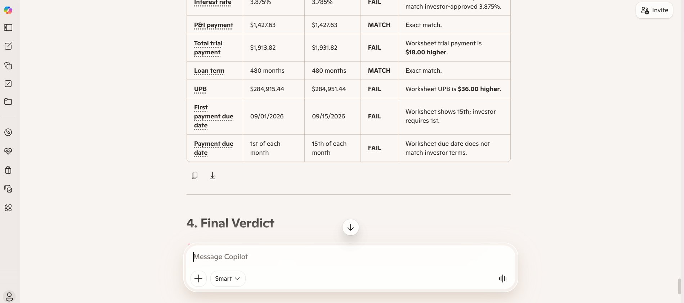

# VERA — The Validation Layer for Mortgage Servicing

**Catch every error before it reaches the borrower — in seconds, around the clock.**

VERA is an AI validation platform for mortgage servicing transfers. It performs the exception-based checking that operations teams do by hand — comparing loan data against source documents — but in seconds, with every check explainable and logged for audit.

Built by a frontline servicing operations professional, not an engineering team. VERA exists because most operational problems don't need more people — they need smarter workflows.

> 📸 **See it in action:** the screenshot below shows VERA Validate catching four data-entry errors on a real-format loan modification — including the exact dollar variance on each — and correctly placing the loan on HOLD before it could board.

---

## Two Engines, One Platform

### 🛡️ VERA Validate — *Exception Detection & Pre-Boarding QC*
Checks every loan against its source documents **before** it boards.
- Reads real document formats (investor approval letters, underwriting worksheets)
- Compares boarded terms against the source of truth, field by field
- Flags every mismatch with an audit-ready comment and dollar variance
- **7 seconds per loan** vs. ~15 minutes manual · **100% accuracy** across 100+ synthetic test loans

### ⚙️ VERA Build — *Automated Repayment Plan Boarding*
Turns messy prior-servicer transfer data into clean, boardable repayment plans.
- Reads dense, fixed-width transfer reports (S2MR-style)
- Extracts plan terms, payment schedules, and frequency counts
- Validates the math and flags judgment items for human review
- **120 hours of manual boarding → minutes**, with zero errors across synthetic test plans

---

## Why It Matters to a Servicer

| Scale | 24/7 | Protect |
|---|---|---|
| More volume without more headcount | No breaks, no sick days, no missed rules | Errors caught before borrowers feel them |

Bad transfer data becomes misapplied payments, wrong plan terms, escalations, and compliance exposure. VERA catches it upstream — before any of that reaches the borrower.

---

## How It Works (Demo)

VERA was prototyped using enterprise AI tooling (Microsoft Copilot) and a structured prompt framework grounded in six years of servicing operations experience: source-of-truth hierarchy, field-level validation rules, exception handling, and audit logging.

Full demo write-ups: [VERA Validate](VERA_Validate_Demo.md) · [VERA Build](VERA_Build_Demo.md)

### VERA Validate — demonstration sequence
1. **Clean loan → CLEAR TO BOARD** (proves no false alarms)
2. **Real documents, terms match → CLEAR** (reads a prose investor letter + a table-format worksheet, and understands that "three and seven-eighths percent" = "3.875%")
3. **Real documents, planted errors → HOLD** (catches transposed rates, wrong dates, and balance errors — and calculates the exact dollar variance on each)

### VERA Build — demonstration
Reads a multi-loan transfer report and extracts a clean, board-ready repayment plan for any loan: balance, total, payment count, full schedule — plus flagged items for review.

*(Demo screenshots and synthetic sample documents are included in this repository.)*

---

## About the Builder

Mary Bielma — mortgage servicing operations professional with 6+ years across servicing transfers, loan boarding, loss mitigation, bankruptcy, and compliance. MIT Sloan Executive Education: *AI: Implications for Business Strategy* (Certificate) and *Machine Learning in Business* (in progress).

VERA is the product of understanding mortgage servicing deeply enough to translate operational failures into AI-assisted controls.

---

## What's Next

VERA is an actively evolving platform. Planned next steps:
- **Expand validation coverage** to additional workout types (forbearance, partial claims, USDA/VA modifications)
- **Excel-native engine** — most servicing operations run on spreadsheets; a version that reads and validates tracker workbooks directly
- **Confidence scoring** on each flagged exception to help teams triage review queues
- **Batch processing** to validate an entire transfer file in one pass with a summary exception report

---

> **Note on data:** Every document and example in this repository is **fully synthetic**. No proprietary, borrower, or company information is included. All servicer names, loan numbers, balances, and dates are fictitious and created solely for demonstration.
